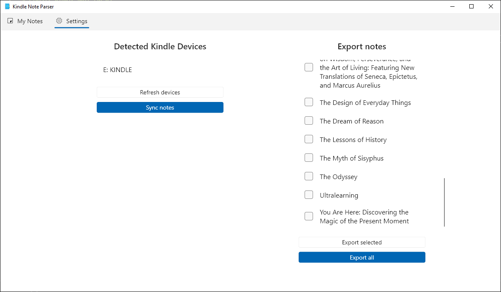

# Flutter Kindle Note Parser

---

- Kindle Note Parser is a flutter windows app for parsing and browsing kindle highlights 
- Kindle Note Parser supports exporting your highlights to pdf files
- It parses notes by reading My Clippings.txt from your kindle documents

---

